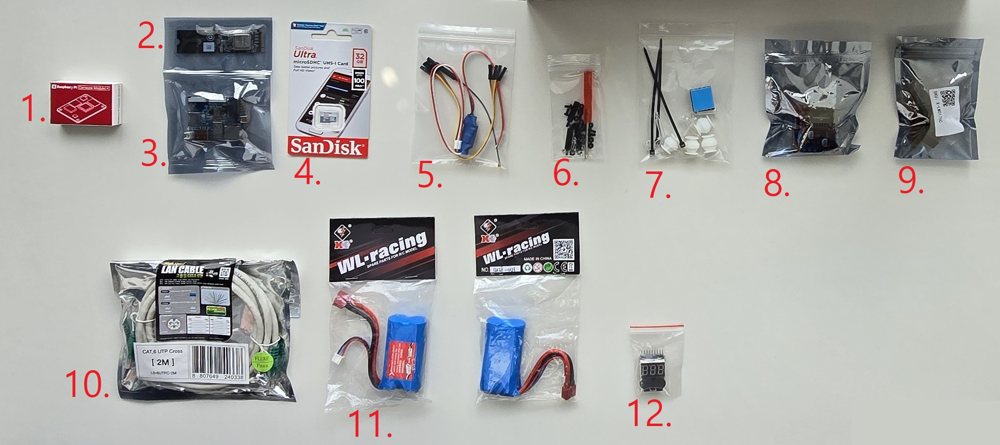
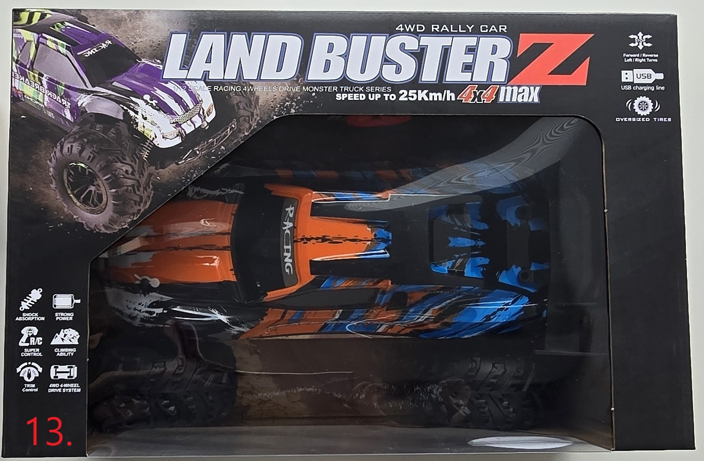
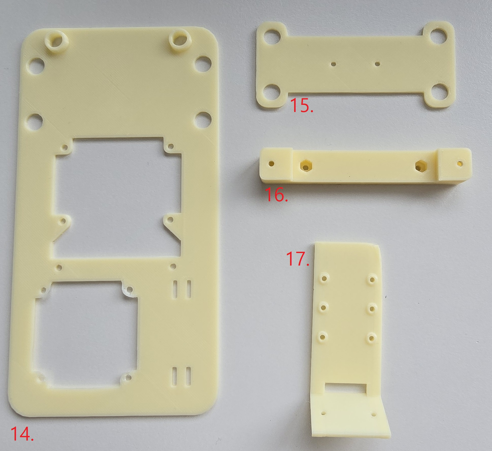

# Bom

이 페이지에는 ZAiV RC CAR의 구성에 필요한 부품이 나열되어 있습니다 부품을 받은 후 [hardware setup](./hardware_setup.md)을 따라하세요.

## RC CAR

| No. | 품명 | 개수 | 비고 |
|:----:|:----:|-----|-------|
| 1. | 라즈베리파이 cm4 | 1 | CM4102000 |
| 2. | ZAiV-m.2 | 1 |  |
| 3. | ZAiV-AHPm | 1 |  |
| 4. | Micro SD Card | 1 | 32GB |
| 5. | ZAiV-AHPm 전원 커넥터 | 1 |  |
| 5. | 점퍼 케이블 | 6 | Female to Female, 20cm, 2개는 커팅해서 DC 5v 강하모듈에 사용 |
| 5. | DC 5v 강하모듈 | 1 | 7.4v의 배터리 전압을 5v로 강하시켜 ZAiV-AHPm에 전원을 공급하는 모듈 |
| 7. | 방열판 | 2 | 20x20x10(mm) |
| 7. | 댐퍼 세트 | 1 | 1 세트에 댐퍼 4개 |
| 8. | 모터 드라이버 | 1 | L298N |
| 11. | 리튬이온 배터리 | 2 | 7.4v 2cell |
| 12. | 배터리 체커기 | 1 | 배터리 전압체커기(7.5v 이하로 내려가면 충전 필요) |
| 13. | RC CAR | 1 |  |
| 13. | 리튬이온 배터리 충전 케이블 | 1 | Input usb A 5V 1A, Rc Car 박스 내부의 배터리 박스에 위치 |

## 베이스 보드

| No. | 품명 | 개수 | 비고 |
|:---:|:----:|-----|-------|
| 14. | 베이스 플레이트 | 1 |  |
| 15. | 댐퍼 플레이트 | 1 | |
| 16. | 차대 연결 부품 | 1 |  |
| 17. | 카메라 브라켓 | 1 | |

## 인터넷

| No. | 품명 | 개수 | 비고 |
|:----:|:----:|-----|-------|
| 5. | cm4 Wi-Fi 안테나 | 1 |  |
| 10. | LAN 케이블 | 1 | CROSS LAN 케이블 |

## mipi 카메라

| No. | 품명 | 개수 | 비고 |
|:----:|:----:|-----|-------|
| 9. | mipi 카메라 | 1 | 160-degree FoV |
| 9. | mipi 카메라 케이블 | 1 | 15pin to 22pin |

## 조립 Hardware

| No. | 품명 | 개수 | 비고 |
|:----:|:----:|-----|-------|
| 6. | 십자 드라이버 | 1 |  |
| 6. | M2x8mm 스틸 볼트너트 세트 | 4 | 카메라 브라켓 & 카메라 고정용 |
| 6. | M2.5x5mm 나일론 볼트 너트 세트 | 11 |  |
| 6. | M2.5x5mm 나일론 서포트 | 1 | 나사 길이 제외 |
| 6. | M2.5x20mm 나일론 서포트 | 2 | 나사 길이 제외 |
| 7. | 케이블 타이 | 3 |  |

## Next

[hardware setup](./hardware_setup.md)을 따라하세요.