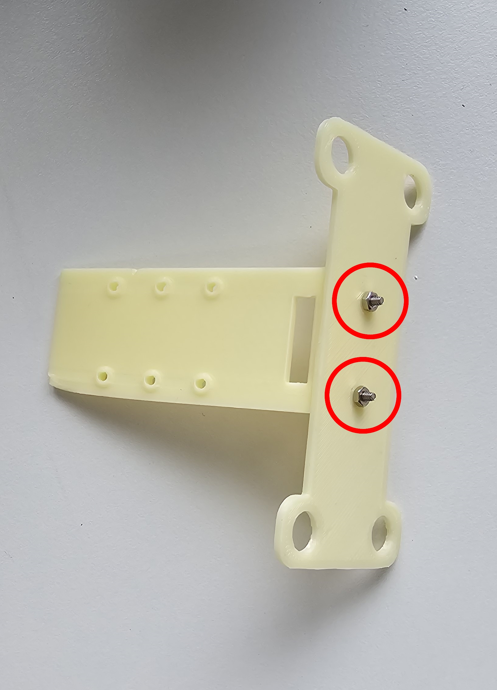
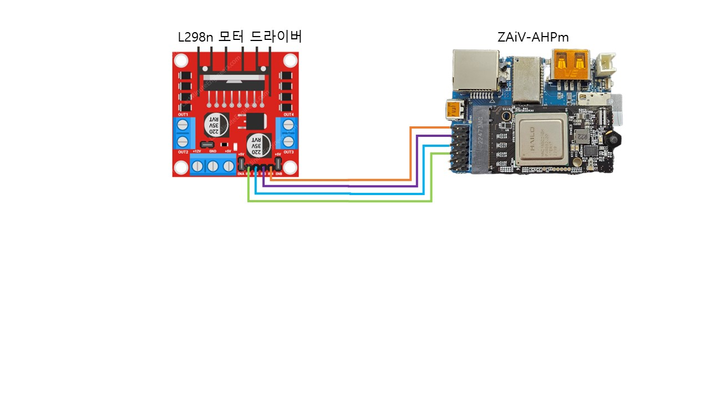

# Hardware Setup

이 페이지에는 ZAiV RC CAR의 구성에 필요한 hardware setup이 있습니다. hardware setup이 끝난 후 [software setup](./software_setup.md)을 따라하세요.

## Tools

* 와이어 스트리퍼
* 십자 드라이버
* 볼트/너트/서포트
* 수축튜브

## Step 1 - Rc Car 분해 및 기본 세팅
### Step 1-1 - Rc Car 커버 제거

1. Rc Car 박스에서 Rc Car를 꺼낸 후 배터리 박스에서 배터리 충전기를 꺼냅니다.

2. Rc Car의 전방에서 2개의 핀을 뽑은 후 보관합니다.

3. 십자 드라이버를 사용하여 Rc Car의 후방에서 볼트 2개를 제거 후 보관합니다.

4. 고정이 해제된 Rc Car의 커버를 제거 후 보관합니다.

### Step 1-2 - Rc Car 상판 제거

1. 위 사진에 표시되어 있는 볼트를 총 6개 제거합니다. 이 때 중간의 볼트 2개는 Step 2-6에서 사용함으로 따로 보관합니다.

### Step 1-3 - 기존 통신보드 제거

1. 사진의 보드를 십자드라이버를 이용하여 분리 후 연결되어 있는 전선을 니퍼나 가위로 잘라줍니다.
    > 전선은 아래의 Step 3 에서 사용하므로 최대한 길게 잘라 주십시오.

2. 자른 전선을 와이어 스트리퍼를 이용하여 피복을 벗긴 후 납땜하여 고정시킵니다.

### Step 1-4 - 배터리 단자 납땜

1. Rc Car를 뒤집어 십자 드라이버를 사용하여 배터리 커버를 분리해 줍니다.

1. 기존의 배터리 단자를 제거하고 사용하려는 배터리에 맞는 단자를 납땜하여 줍니다.
    > +는 빨간색, -는 검정색으로 구분합니다.

2. 쇼트 방지를 위하여 수축튜브나 절연테이프로 절연처리를 합니다.

### Step 1-5 - DC 5v 강하모듈 케이블 납땜

1. DC 5v 강하모듈과 ZAiV-AHPm 전원 커넥터를 out방향에 사진과 같이 납땜합니다.
    > +는 빨간색, -는 하얀색으로 구분합니다

2. 점퍼케이블 2개를 이용하여 in방향에 사진과 같이 납땜합니다.
    > +는 빨간색, -는 검정색으로 구분합니다.

3. 쇼트 방지를 위하여 수축튜브나 절연테이프로 절연처리를 합니다.

### Step 1-6 - ZAiV-m.2, cm4 방열판 장착

1. 사진을 참고하여 ZAiV-m.2와 cm4에 방열판을 장착합니다.

## Step 2 - hardware 조립
### Step 2-1 - 카메라 브라켓과 댐퍼 플레이트 결합

1. M2x8mm 스틸 볼트너트 2개를 사용하여 카메라 브라켓과 댐퍼 플레이트를 결합합니다.

### Step 2-2 - 댐퍼 플레이트와 베이스 플레이트 결합

1. 베이스 플레이트의 앞쪽의 튀어나온 곳을 기준으로 댐퍼를 결합합니다.
    > 댐퍼를 결합시에는 댐퍼가 찢어지지 않도록 날카로운 도구는 사용을 금합니다.

2. 베이스 플레이트에 결합된 댐퍼를 댐퍼 플레이트와 결합합니다.

3. 사진을 참고하여 댐퍼와 함께 제공된 고정핀의 방향에 주의하여 고정핀을 체결합니다.

### Step 2-3 - cm4와 cm4 Wi-Fi 안테나 결합

1. cm4와 cm4 Wi-Fi 안테나를 사진과 같이 결합합니다.

### Step 2-4 - cm4와 베이스 플레이트 결합

1. CM4의 방향에 주의하여 베이스 플레이트의 지정된 자리에 놓습니다.

2. 제공된 나일론 볼트 너트로 각 모서리 4군데를 체결합니다. 이때 볼트의 방향을 사진과 동일하게 체결합니다.

### Step 2-5 - 모터 드라이버와 베이스 플레이트 결합

1. 모터 드라이버의 방향에 주의하여 베이스 플레이트의 지정된 자리에 놓습니다.

2. 제공된 나일론 볼트 너트로 각 모서리 4군데를 체결합니다.

### Step 2-6 - Rc Car와 차대 연결 부품 결합

1. 차대 연결 부품의 구멍에 나일론 너트 2개를 끼워 넣습니다.

2. M2.5x20mm 나일론 서포트 2개를 사진처럼 결합합니다.

3. 차대 연결 부품을 사진처럼 Rc Car의 중간 부분에 위치 시킵니다.

4. Step 1-2에서 Rc Car의 상판을 제거할때 나온 볼트 2개를 이용하여 Rc Car와 차대 연결 부품을 결합합니다.

### Step 2-7 - RC Car와 베이스 플레이트 결합

1. Rc Car의 전방에서 2개의 핀을 뽑은 후 베이스 플레이트의 앞쪽의 홀과 Rc Car의 커버가 고정되어 있던 부분에 끼워 장착합니다.

2. 끼워서 장착 후 Rc Car의 커버를 고정시켰던 핀을 다시 장착하여 고정합니다.

3. 베이스 플레이트의 중간에 뚤려있는 2개의 홀과 앞서 Step 2-6에서 장착한 M2.5x20mm 나일론 서포트에 나일론 볼트 2개를 이용하여 고정합니다.

### Step 2-8 - cm4 Wi-Fi 안테나 고정

1. cm4 Wi-Fi 안테나를 사진과 같이 M2.5x20mm 나일론 서포트 부위에 케이블타이로 고정합니다.

### Step 2-9 - ZAiV-AHPm 세팅 및 ZAiV-m.2 고정 브라켓 장착

1. ZAiV-AHPm의 전원 단자 핀을 사진을 참고하여 짧게 잘라줍니다.

2. ZAiV-AHPm의 딥스위치를 사진과 같이 세팅합니다.
    > SW1은 OFF, SW2는 ON으로 세팅합니다.

3. ZAiV-m.2를 고정하기 위하여 M2.5x5mm 나일론 서포트와 M2.5x5mm 나일론 볼트를 이용하여 사진과 같이 고정합니다.

### Step 2-10 - 카메라와 CM4 장착

1. 사진을 참고하여 카메라와 카메라 케이블의 방향을 맞춰 장착합니다.

2. 카메라를 카메라 브라켓에 M2x8mm 스틸 볼트너트 2개를 이용하여 고정시킵니다.

3. 카메라 케이블을 사진을 참고하여 댐퍼 플레이트와 베이스 플레이트의 사이로 통과시킵니다.

4. 사진을 참고하여 카메라 케이블을 ZAiV-AHPm의 카메라 포트에 방향에 맞춰 장착합니다.

5. ZAiV-AHPm를 cm4에 위치시킨 후 사진에 표시된 부분을 눌러 장착합니다.

### Step 2-11 - ZAiV-m.2 장착

1. 사진을 참고하여 ZAiV-m.2를 ZAiV-AHPm의 m.2 슬롯에 45도 각도로 장착 후 M2.5x5mm 나일론 너트를 이용하여 고정시킵니다.

## Step 3 - 케이블 연결

### Step 3-1 - 모터 케이블 연결

1. 사진을 참고하여 색상에 주의하여 좌우 조향, 전진 모터 케이블을 모터 드라이버에 장착합니다.

### Step 3-2 - 전원 케이블, DC 5v 강하모듈 케이블 및 ZAiV-AHPm 전원 커넥터 연결 

1. 사진을 참고하여 전원 스위치에서 나온 빨간색 케이블(+)과 DC 5v 강하모듈의 in+ 케이블을 모터 드라이버의 12v 단자에 십자드라이버를 이용하여 같이 고정합니다.

2. 사진을 참고하여 배터리 케이블에서 나온 검정색 케이블(-)과 DC 5v 강하모듈의 in- 케이블을 모터 드라이버의 GND 단자에 십자드라이버를 이용하여 같이 고정합니다.

3. 사진을 참고하여 케이블 타이를 이용하여 DC 5v 강하모듈을 고정합니다.

4. 사진을 참고하여 DC 5v 강하모듈 out 부분에 연결된 ZAiV-AHPm 전원 커넥터를 ZAiV-AHPm에 연결합니다.

### Step 3-3 - 점퍼 케이블 연결

1. 사진을 참고하여 ZAiV-AHPm과 모터 드라이버를 점퍼 케이블로 연결합니다.

### Step 3-4 - 배터리 체커기 연결방법

1. 배터리의 하얀색 커넥터의 검은색 라인에 배터리 체커기의 가장 왼쪽 단자를 기준으로 연결합니다.

2. 비프음이 두번 울린뒤 배터리의 전체 전압, 1셀 전압, 2셀 전압 순으로 표시됩니다.
전체 전압이 7.5v 이하가 되면 충전이 필요합니다.

### Step 3-5 - SD카드, 배터리 연결

1. 사진을 참고하여 SD카드와 배터리를 연결한 후 배터리 커버를 고정시킵니다.

### Step 3-6 - Rc Car 커버 가공 후 장착

1. Rc Car 커버를 사진과 같이 가공하여 장착합니다.

## 주의사항

Rc Car가 뒤집혔을 때 카메라 브라켓이 땅에 닿으면 파손 될 수 있습니다.

## Hardware setup complete!

## Next

[software setup](./software_setup.md)을 따라하세요.
