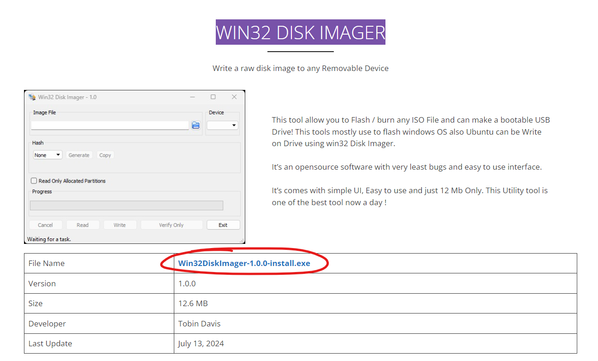
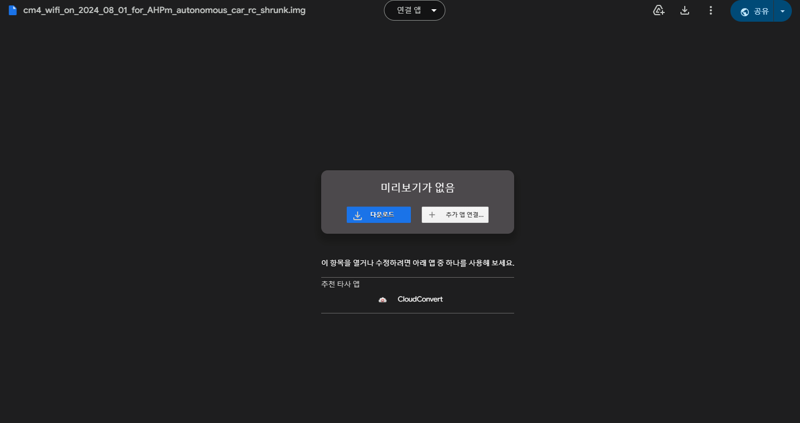
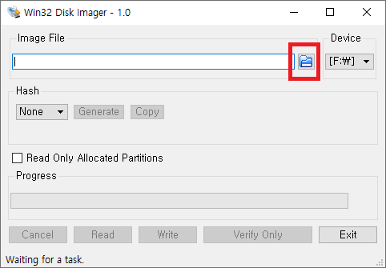
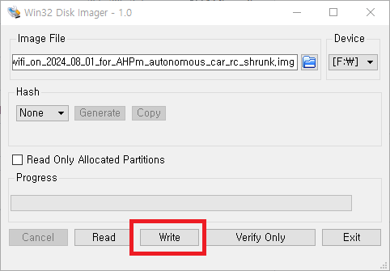

# Software Setup Guides

이 페이지에는 ZAiV RC CAR의 구성에 필요한 software setup이 있습니다.

## Step 1 - OS Setup
### Step 1-1 - Win32diskimager Install



* https://win32diskimager.org/ 로 이동한 다음 win32diskimager를 다운로드하고 설치합니다.

### Step 1-2 - 라즈베라파이 이미지 다운로드



* [구글 드라이브 링크](https://drive.google.com/file/d/1UW0SIPWCbd3zD2XrMaHbgLWok_XjHvC4/view?usp=drive_link)를 이용하여 이미지를 다운합니다.

### Step 1-3 - SD Card Writing




* microSD 카드를  microSD Writer에 장착한 후 PC에 삽입합니다. (USB 3.0 권장)
* 설치된 win32diskimager를 실행합니다.
* 실행된 win32diskimager에서 폴더 모양 아이콘을 클릭하여 제공된 이미지를 선택하세요.
* "Write"를 클릭합니다. (경고 메시지가 나타나면 "예"를 클릭하여 진행하세요)
* 쓰기 및 확인 과정은 SD Card Writer에 따라 다를 수 있으며, USB3.0을 사용하는 경우 약 7분 정도 소요됩니다.
* 완료 후 마이크로 SD 카드를 ZAiV-AHPm에 삽입하세요.

## Step 2
### Wi-Fi AP Name 변경
* Terminal open
* 설정파일 열기
```
sudo nano i2c-lcd-and-ap-mode-control/ap_config.json
```
* "ssid"항목을 원하는 ap 이름으로 변경
* "CTRL + X > Y" 로 저장
* Reboot

## ETC - Bash files
1. gst_pipe.bash
    >cam, mp4의 detection 결과를 hailoexportzmq을 사용하여 zmq 결과를 보내주는 .bash

    > 처음실행시 cam, mp4 터미널에서 선택가능

2. recode.bash
    >cam 화면을 녹화하는 gstreamer .bash

3. test.bash
    >cam 화면을 ximagesink을 이용하여 비디오 테스트하는 gstreamer .bash

4. test_dc_rc_car_ya.py
    >rc car를 조종하는 .py

    >실행시 먼저 ap모드 연결 후 192.168.50.1의 gamepad 실행필요

5. zmq_rc_move_test.py
    >gst_pipe.bash에서 보낸 zmq 결과를 받은 후 파싱하여 opnecv imshow로 출력 후 rc car를 동작시키는 자율주행 .py
